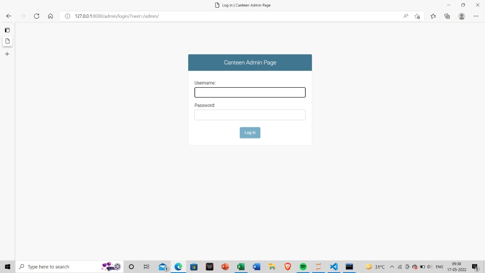
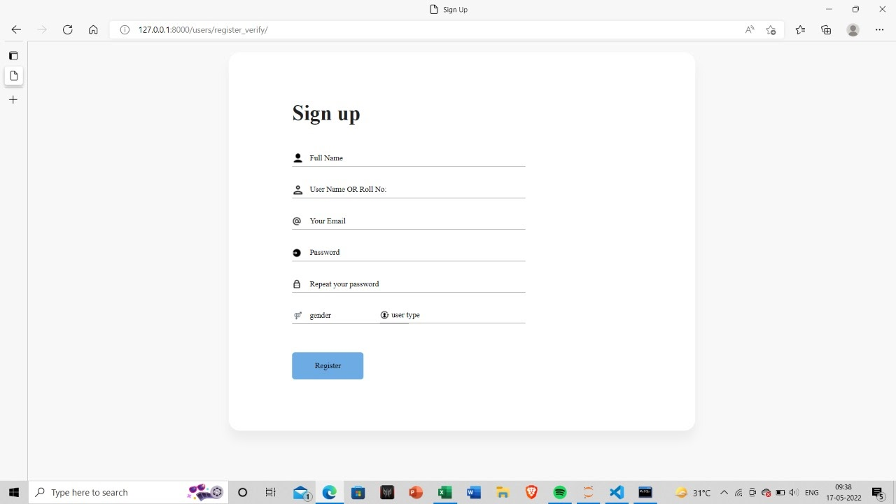
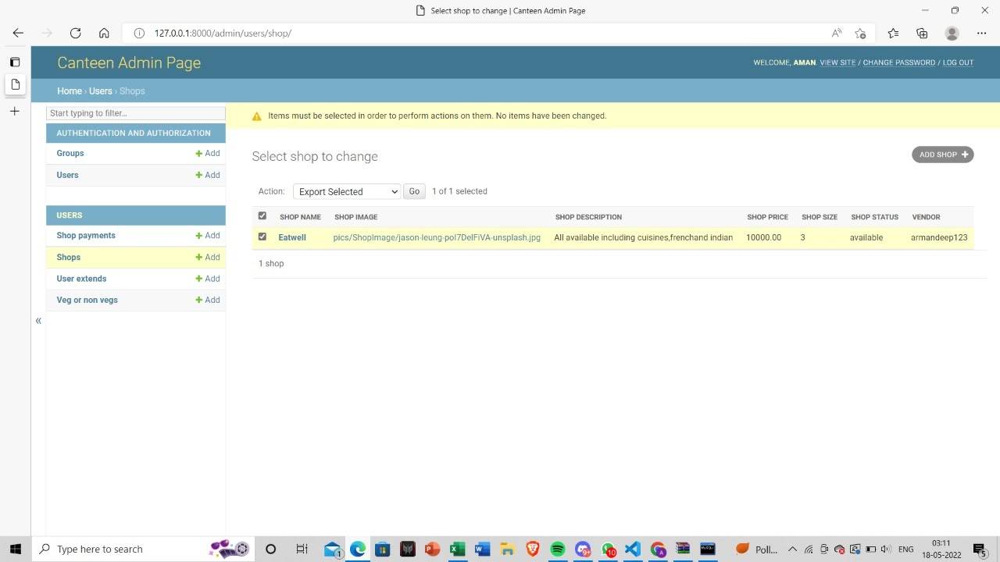
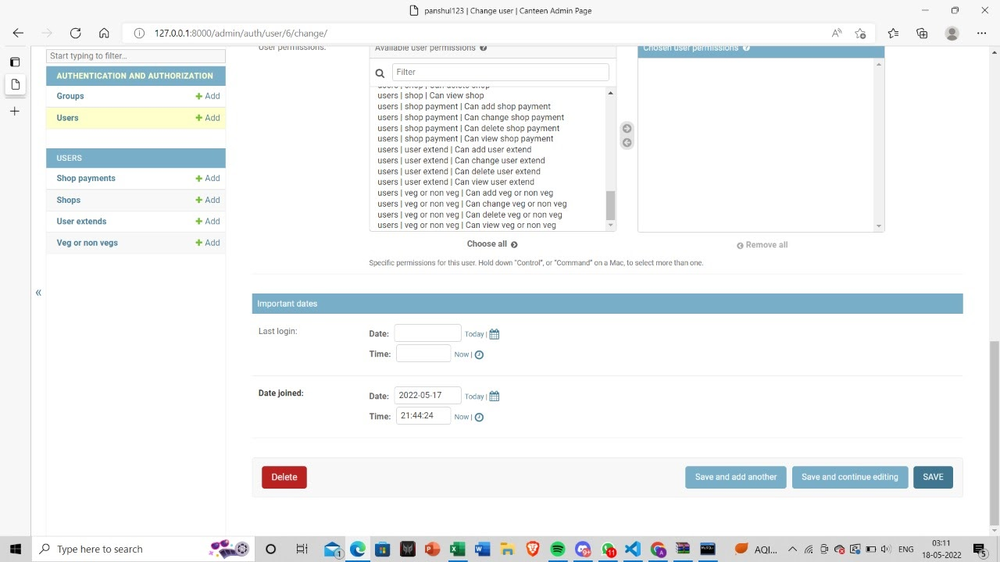
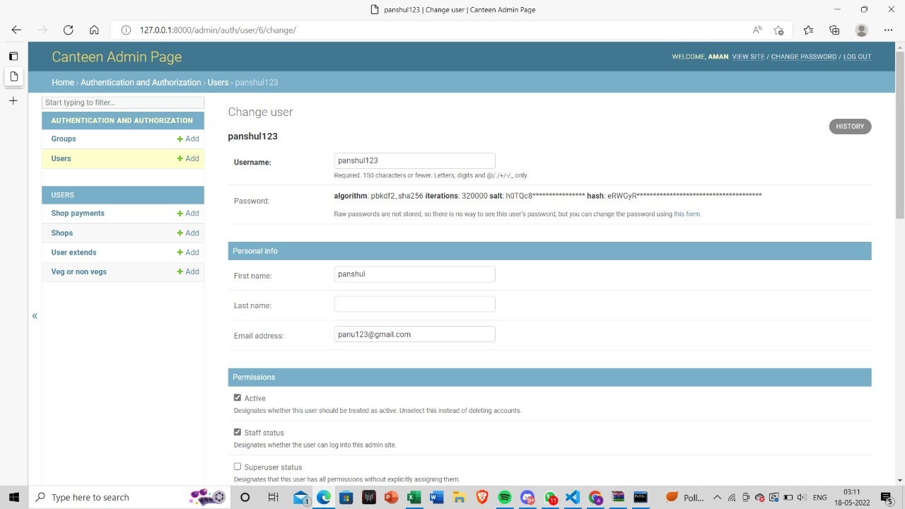
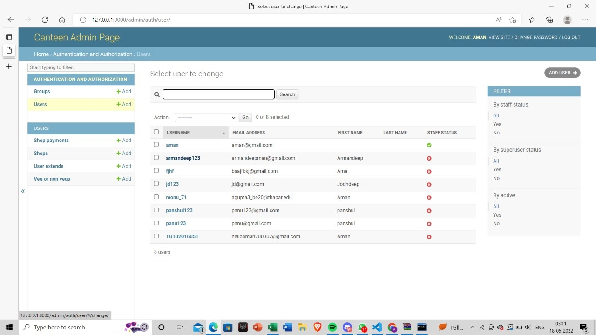

# Comido (your food companion)
Canteen Management System is used to place the food orders and has two parts to it, namely the admin side and user side. 
The user can order food from the coolege canteen through the website. 

## Features
1. It is able to authenticate the user by matching the username and password against the values stored in the database.
2. It will show the items available in the menu.
3. User-friendly interface
4. Multiple users can run the website at a time. 

## Screenshots
### Sign up page

